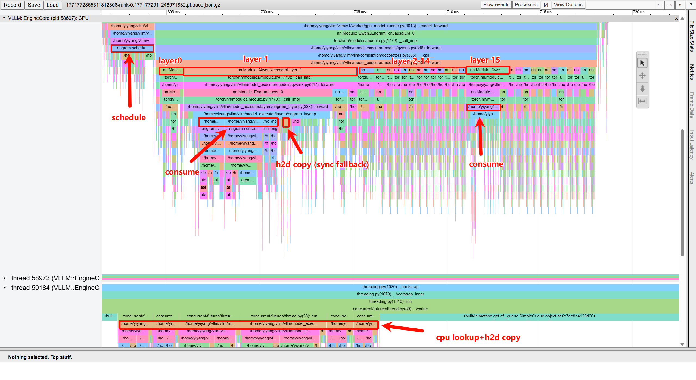
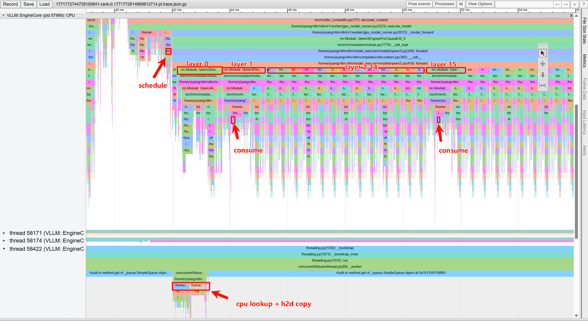

# Engram Plugin for Qwen3 in vLLM

This directory contains an inference-focused Engram integration for Qwen3 in vLLM.
The current implementation uses:

- Real Qwen3 base model weights (`Qwen/Qwen3-1.7B`)
- Synthetic Engram weights/tables (for Engram branches only)
- CPU-side token compression/hash/table lookup with GPU-side Engram compute

## Current Status and Scope

Supported path:

- Architecture override: `Qwen3EngramForCausalLM`
- Plugin registration via `VLLM_PLUGINS=register_engram_plugin`

Current runtime constraints:

- Eager execution is required (`enforce_eager=true`)
- BF16 is required
- Pipeline parallelism is not supported
- Expert parallelism is not supported
- Speculative decoding is not supported
- CUDA graph mode and `torch.compile` mode are not supported
- Synthetic Engram weights are required (`engram_use_synthetic_weights=true`)

# Performance

## Benchmark Snapshot (Engram vs Golden)

The table below summarizes a snapshot comparison from `run_bench.sh` (Engram)
and `run_bench_golden.sh` (no Engram) under the same benchmark setup
(256 successful requests, max concurrency 16). These numbers are from one
reported run and should be interpreted as point-in-time measurements. The
workload uses an approximately 2K input + 2K output setting per request
(`2048` input tokens, `2040` output tokens).

| Metric | Qwen3-1.7B | Qwen3-1.7B+0.26B Engram | Delta (Engram - Golden) |
|---|---:|---:|---:|
| Mean TTFT (ms) | 571.53 | 587.93 | +2.87% |
| Mean TPOT (ms) | 24.15 | 24.32 | +0.70% |
| Output token throughput (tok/s) | 654.74 | 649.86 | -0.75% |
| Total token throughput (tok/s) | 1312.05 | 1302.26 | -0.75% |

Note: positive delta is worse for latency metrics, while negative delta is
worse for throughput metrics.

## Trace Interpretation (Prefill vs Decode)

### Prefill Trace



- Key terms:
- `CPU lookup`: host-side token compression/hash/table lookup.
- `H2D copy`: host-to-device transfer of lookup embeddings.
- `sync fallback`: layer consumes fallback path when prefetched data is not ready in time.
- `Engram layer 0/1`: first and second enabled Engram transformer layers in the step.

- Interpretation:
- In prefill, CPU lookup + H2D staging can still be long enough to stay on the critical path.
- Because of that delay, the first Engram layer may miss prefetch readiness and fall back to synchronous H2D copy.
- The second Engram layer typically consumes prefetched data successfully and behaves as expected.

### Decode Trace



- Interpretation:
- In decode, CPU-side lookup work is effectively overlapped by GPU computation.
- Both Engram layers show healthy overlap behavior, with no notable sync-copy fallback on the critical path in this snapshot.

- Caveat:
- These traces are point-in-time observations from this benchmark environment and may vary by hardware, driver, and workload.

## Prerequisites

From repository root:

```bash
source ../venv-torch/bin/activate
pip install -e examples/plugins/engram
```

Notes:

- Adjust the virtualenv path if your environment is different.
- Ensure `Qwen/Qwen3-1.7B` is available to your runtime.
- Engram tables are host-resident, so both CPU memory and GPU memory matter.

## How to Enable Engram (Step by Step)

1. Use the Engram config file:
   `examples/plugins/engram/configs/serve_engram_dummy.yaml`

2. Launch server:

```bash
source ../venv-torch/bin/activate
VLLM_PLUGINS=register_engram_plugin \
vllm serve --config examples/plugins/engram/configs/serve_engram_dummy.yaml
```

3. Verify health:

```bash
curl --noproxy "*" http://127.0.0.1:8000/health
```

4. Send a chat completion request:

```bash
curl --noproxy "*" -v http://127.0.0.1:8000/v1/chat/completions \
  -H "Content-Type: application/json" \
  -d '{
    "model": "Qwen/Qwen3-1.7B-Engram",
    "messages": [{"role":"user","content":"What is the capital city of China?"}],
    "max_tokens": 256,
    "temperature": 0,
    "stream": false
  }'
```

5. Confirm model name usage:

- `served_model_name` in Engram config is `Qwen/Qwen3-1.7B-Engram`
- Request payload `"model"` must match that served name

## Baseline (No Engram)

Use:
`examples/plugins/engram/configs/serve_qwen3_real_no_engram.yaml`

Serve:

```bash
source ../venv-torch/bin/activate
vllm serve --config examples/plugins/engram/configs/serve_qwen3_real_no_engram.yaml
```

Request model name for baseline:

- `"model": "Qwen/Qwen3-1.7B"`

## Main Implementation Features

High-level runtime flow:

1. Real token IDs are carried in forward context payload (`engram_step`).
2. Per-request token history is maintained (strict request isolation).
3. CPU path performs:
   - token compression
   - DeepSeek-style n-gram hashing
   - host table lookup
4. Lookup embeddings are transferred to GPU for Engram compute.
5. GPU Engram branch computes:
   - `k = e @ W_k`
   - `v = e @ W_v`
   - RMSNorm-based gating (`alpha`)
   - `u = alpha * v`
   - `y = SiLU(Conv1D(RMSNorm(u))) + u`
6. Residual update is applied back to hidden states.

Performance-oriented runtime features:

- Separate prefill and decode forward paths
- Async CPU lookup prefetch from model runner
- Decode-step batched prefetch consume path
- Request-boundary-safe hashing and lookup (no cross-request n-grams)

## Configuration Reference

Engram-related keys are provided through `hf_overrides.*` in YAML.

| Key | Type | Meaning | Typical Value |
|---|---|---|---|
| `engram_enable` | bool | Enable Engram path | `true` |
| `engram_layers` | list[int] | 0-based transformer layers with Engram | `[1, 15]` |
| `engram_memory_size` | int | Rows per Engram table | `129800` |
| `engram_max_ngram_order` | int | Max n-gram order | `3` or `4` |
| `engram_heads` | int | Number of Engram heads | `4` |
| `engram_mem_dim` | int | Concatenated Engram table embedding width | `1024` |
| `engram_compression_ratio` | float | Token compression ratio in `(0, 1]` | `0.8` |
| `engram_conv_kernel` | int | Causal conv kernel size | `4` |
| `engram_conv_dilation` | int | Causal conv dilation | `3` |
| `engram_async_workers` | int | CPU prefetch worker count (positive int) | `1` |
| `engram_use_synthetic_weights` | bool | Use synthetic Engram parameters | `true` |
| `engram_synthetic_seed` | int | Seed for synthetic Engram params/tables | `2026` |
| `architectures` | list[str] | Model architecture override | `["Qwen3EngramForCausalLM"]` |

Important notes:

- `engram_layers` is 0-based.
- `engram_mem_dim` must be large enough to cover all `(order, head)` table slices.
- `engram_async_workers` must be `>= 1`.
- Keep `engram_compression_ratio` within `(0, 1]`.

Minimal working snippet:

```yaml
"hf_overrides.architectures": '["Qwen3EngramForCausalLM"]'
"hf_overrides.engram_enable": "true"
"hf_overrides.engram_layers": "[1,15]"
"hf_overrides.engram_memory_size": 129800
"hf_overrides.engram_max_ngram_order": 3
"hf_overrides.engram_heads": 4
"hf_overrides.engram_mem_dim": 1024
"hf_overrides.engram_compression_ratio": 0.8
"hf_overrides.engram_conv_kernel": 4
"hf_overrides.engram_conv_dilation": 3
"hf_overrides.engram_async_workers": 1
"hf_overrides.engram_use_synthetic_weights": "true"
"hf_overrides.engram_synthetic_seed": 2026
```

## Canonical Cold-Run Benchmark Protocol

Use fresh server per run. Do not use second-run results for comparison.

Engram (repeat 3x, compare median):

1. Start fresh server:

```bash
source ../venv-torch/bin/activate
VLLM_PLUGINS=register_engram_plugin \
vllm serve --config examples/plugins/engram/configs/serve_engram_dummy.yaml
```

2. Run benchmark once:

```bash
vllm bench serve \
  --backend openai-chat \
  --base-url http://127.0.0.1:8000 \
  --endpoint /v1/chat/completions \
  --model Qwen/Qwen3-1.7B \
  --served-model-name Qwen/Qwen3-1.7B-Engram \
  --tokenizer Qwen/Qwen3-1.7B \
  --dataset-name random \
  --random-input-len 2048 \
  --random-output-len 2040 \
  --random-range-ratio 0 \
  --num-prompts 256 \
  --max-concurrency 16 \
  --request-rate 16 \
  --no-stream \
  --save-result \
  --result-dir ./bench_results_random
```

3. Stop server, restart, repeat.

Golden baseline (no Engram):

1. Start fresh server:

```bash
source ../venv-torch/bin/activate
vllm serve --config examples/plugins/engram/configs/serve_qwen3_real_no_engram.yaml
```

2. Run benchmark once:

```bash
vllm bench serve \
  --backend openai-chat \
  --base-url http://127.0.0.1:8000 \
  --endpoint /v1/chat/completions \
  --model Qwen/Qwen3-1.7B \
  --served-model-name Qwen/Qwen3-1.7B \
  --tokenizer Qwen/Qwen3-1.7B \
  --dataset-name random \
  --random-input-len 2048 \
  --random-output-len 2040 \
  --random-range-ratio 0 \
  --num-prompts 256 \
  --max-concurrency 16 \
  --request-rate 16 \
  --no-stream \
  --save-result \
  --result-dir ./bench_results_random
```

Track at least:

- TTFT (mean/median/p99)
- TPOT (mean/median/p99)
- ITL (mean/median/p99)
- Output token throughput
- Total token throughput

## Troubleshooting

### `Connection refused` on `127.0.0.1:8000`

- Server is not ready or not running.
- Check startup logs.
- Check whether port 8000 is already occupied.

### `The model ... does not exist`

- Request `"model"` does not match `served_model_name`.
- Engram server expects `Qwen/Qwen3-1.7B-Engram`.
- Baseline server expects `Qwen/Qwen3-1.7B`.

### Engram runtime guard errors

Typical causes:

- Not using BF16
- `enforce_eager` is not enabled
- CUDA graph mode enabled
- `torch.compile` enabled
- unsupported parallel mode (pipeline/expert)
- speculative decoding enabled

### Plugin not active

- Missing `VLLM_PLUGINS=register_engram_plugin`
- Plugin package not installed: run `pip install -e examples/plugins/engram`

### Benchmark numbers unstable/confusing

- First run after startup has warmup effects.
- Reusing a live server may introduce cache effects.
- Use fresh-server, first-run-only protocol for fair comparison.

## FAQ

### Why are `model` and `served_model_name` different in Engram config?

- `model` points to HF weights source.
- `served_model_name` is API-facing identifier.
- In this setup, Engram uses custom served name to distinguish from baseline.

### If I set `engram_enable=false`, should behavior match baseline?

- It should follow non-Engram model path under the same base model.
- For strict output comparison, use deterministic decoding settings (for example `temperature=0`) and same prompt/input.

### Why is first-run TTFT often higher?

- Startup/warmup overhead (model runtime and kernels) impacts early requests.
- Use cold-run protocol consistently when reporting TTFT.

### How do I keep Engram vs baseline comparisons fair?

- Same hardware, same benchmark parameters, same tokenizer/model family.
- Fresh server for each measurement run.
- Compare first-run metrics only.
